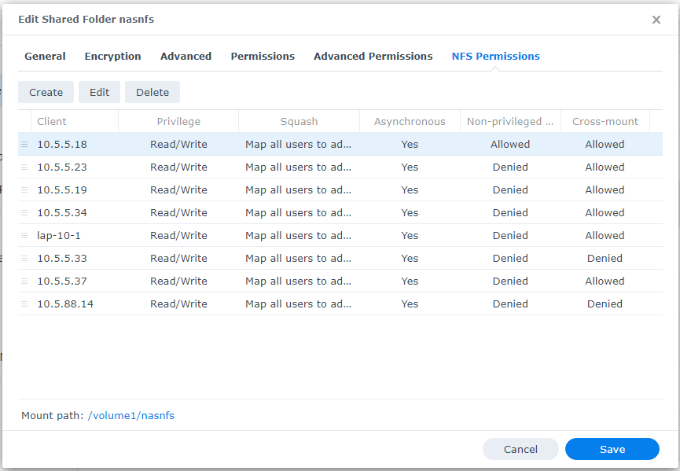
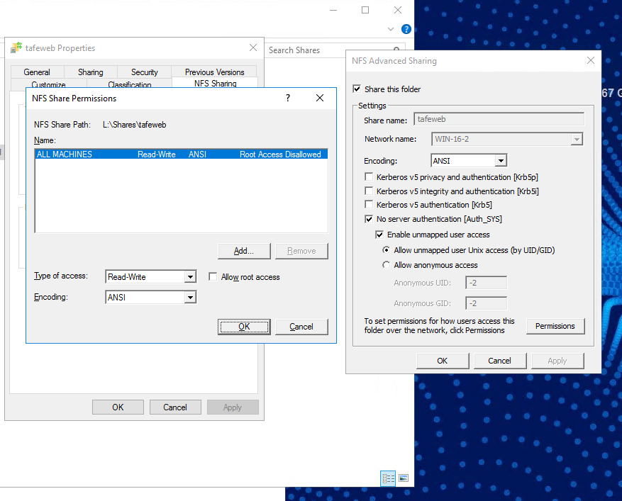

# Synology
Setting up an NFS share on say a synology nas would be the best solution as you can simultaneously view it on a  windows pc and on Linux

Using either host names or ip address, best to using a static ip if for a server anyway

# Windows
Windows is a little more complex as it may not work for you 

Most unrecommended way to do it but you can just make it ip based access 
**AND DO NOT DO THIS IN THE REAL ENVIRONMENT**