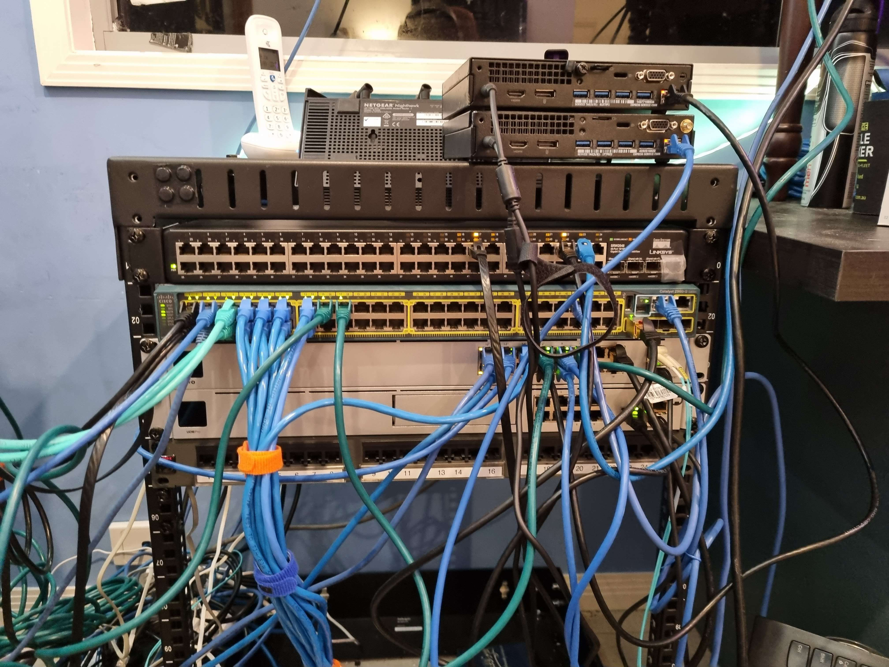

# Router
My router originally was a Pfsense box Virtualized on my server, but now is A UDMP from ubiquity and i regret buying it, i wish i just got a cloud key and bought a netgate appliance or a box i couldve loaded it on

# Switches

1x Cisco Catalyst 2960s

1x Linkys 48p sw

1x Unifi 16 port POE (150w) switch

# AP

1x unifi UAP-AC-nanoHD