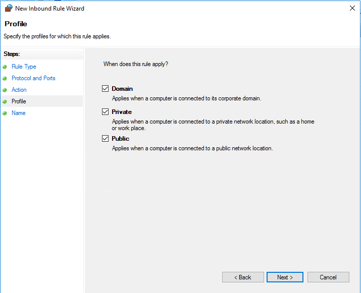
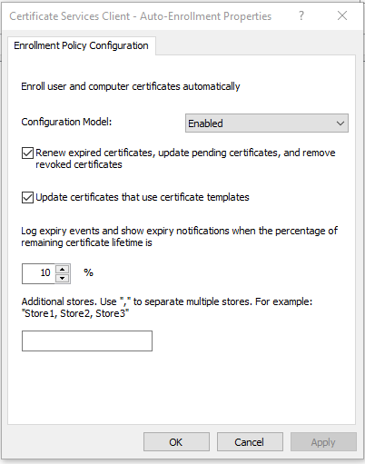
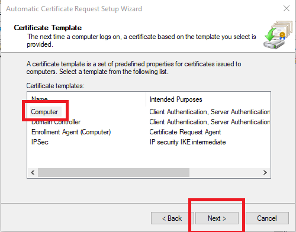

# Windows Network Policy Server & Unifi WiFi

Using Unifi Network Application 7.3.76 and Windows server 2016 Standard Connected to MS Active Directory

# Windows server setup

Login and open server manager and navigate to Add Roles and Features

Tick the boxes below that are highlighted

When Here tick the following

Tick the box thats highlighted

### Once done just hit install and it all should install without needing a restart

## Windows Firewall
Follow the following images below

## Windows CA
Follow the images below

## NPS configuration
Configuring NPS for Radius Auth

# Copy and paste this box below when it comes up in plain text and save it to note pad, You will need this for later

# Select the Template you made earlier

Select The highlighted option in the image

You can use a custom group like i have, since its a group that gives you access to most of my applications or just use "Domain Users"

No Configuration Required here

Hit Finish

# GPO for Ad clients (optional)

Create the GPO in the USERS folder or where you store your users in AD

Computer Configuration > Windows Settings > Security Settings > Public Key Policies 

double click Certificate Services Client Enrollment and fill out the as the image blow is

Expand Public Key policies and right click Automatic certificate request settings and click new automatic certificate request

Click next

Make sure you select Computer

Click finish and your done!

# Unifi Setup

This is pretty straight forward

The Shared Secret is the string you copied earlier into a text file

Keep the ports at default 1812 for auth servers and 1813 for accounting (this is not needed but helps for later troubleshooting)

Goto Settings, Profiles and Create New Radius Profile

Set the name to something useful, Assigned VLAN support is there its just not needed for this, Type the IP of your NPS server and enter the port 1812 for the auth server and the Shared Key is from earlier

Same for the accounting server 

For your Wifi Settings you will need to change from WPA-personal to WPA-Enterprise and select the Profile we made just before, Make sure to Require PMF, this helps with connecting clients and so they dont have issues

Source: https://patrickdomingues.com/2021/10/27/how-to-configure-windows-server-and-unifi-controller-for-radius-wifi-access/
