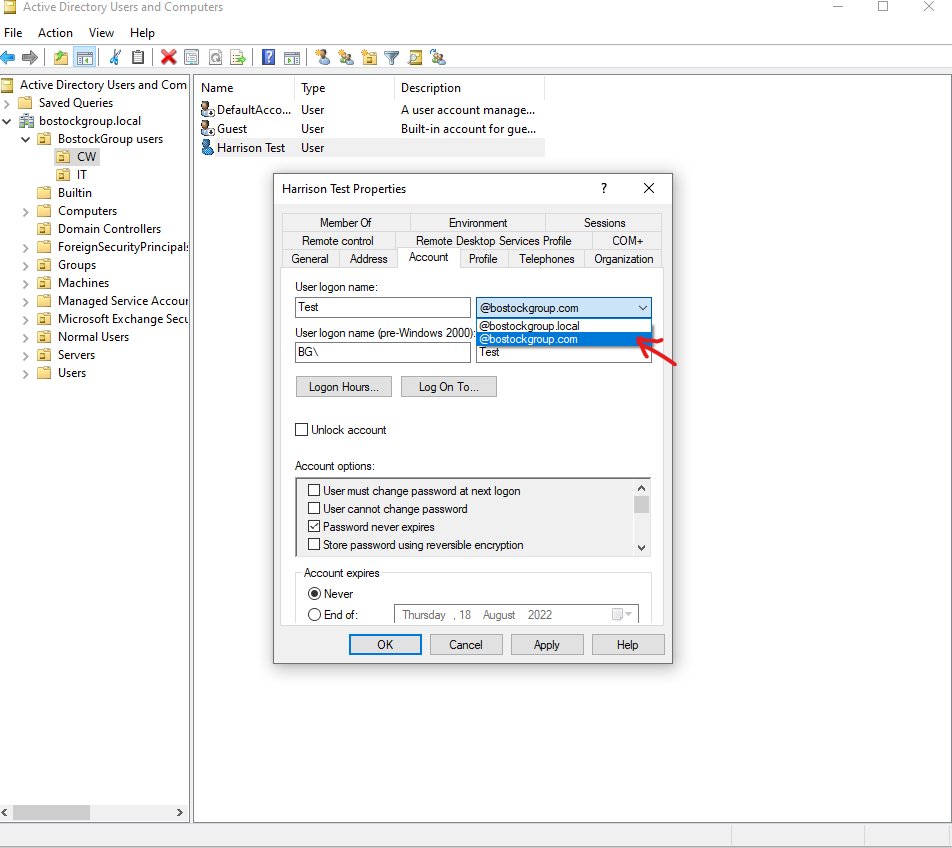
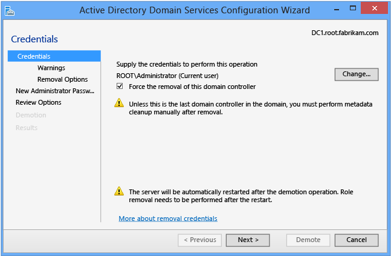
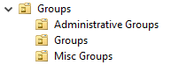
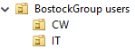
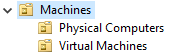

# Azure Cloud Sync 

When setting a new domain up make sure to use a TLD not .local, it makes life a lot easier in the long run
## Emails
Azure and local dc sync, if the account needs an email or license it needs to have a .com not .local to get the proper email

# **Removing a DC**

**Before deleting the domain controller or turning it off for its last time, make sure you demote it as a domain controller AND TICK THE META DATA CLEANUP BOX, otherwise you will face major issues with delegation and replication**

# Groups and Users
When making AD accounts that aren't actual people its best idea for everyone else to understand wtf your actually doing you should put a description of what the account does

# Computer and Server OU's

When setting up AD its best practise to also setup OU's for servers and computers so it makes it easier to apply GPO's to the correct machines for instance: 

	
Its best to keep the server OU separate from the Client computers OU as you may apply an administrative GPO for a client computer on accident

# GPO's
GPO's that are recommended to be setup are 

	- Drive maps for shares
		○ Best to have the it in the user GPO area as it makes it so they can roam between devices and have their files
		○ Don’t use item level targeting instead make a group for each share and have that group with read/write access therefor you can have 1 gpo to map all the drives but will only map the one the user needs
	- Specific wallpaper (not forced, recommended)
		○ Best to have the file copied onto their computer not pulling from a remote server
		○ And having BG-INFO set the wallpaper not the GPO itself therefor it coping the file from the dc instead of caching it
	- NTP server rules
		○ CMOS clocks can become out of sync
	- BG-info, Good for troubleshooting
		○ Makes it easier for helpdesk to identify what computer theyre on and sets custom wallpaper
	- SCCM Rules
		○ Allowing Printer and file sharing
		○ And allowing 2701 for SCCM remote control
		○ The rest of the settings can be found in 
		○ 
	- Security Policy rules
		○ Adding the bg\domain admins to local admins on all client computers 
	- Powershell remote
		○ Allows RDP and TVNC and Remote powershell sessions
	- Printer gpo simply maps the printer for the ou
