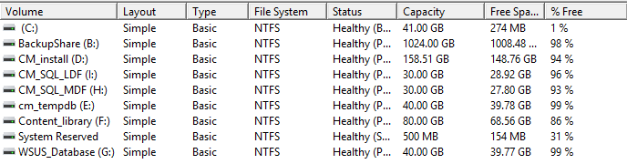
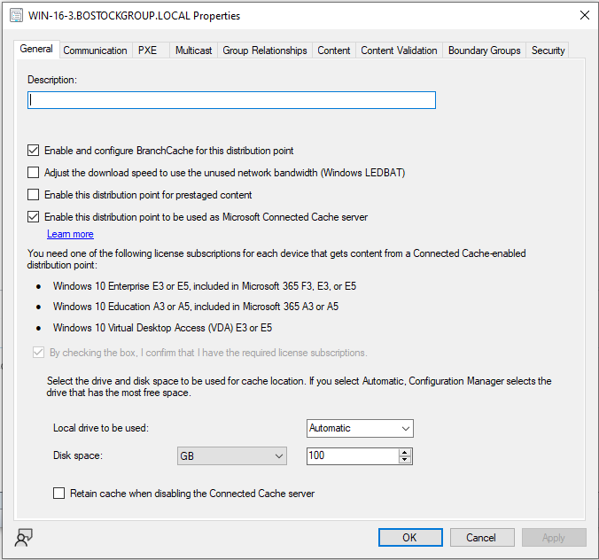
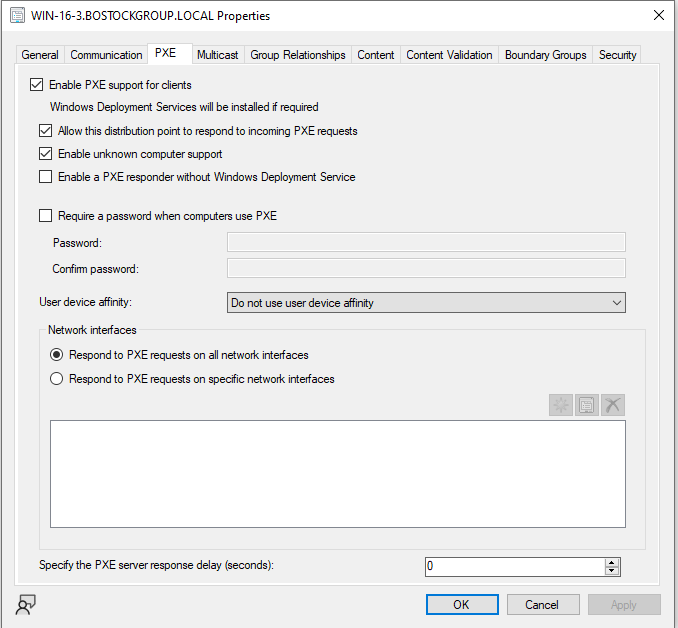
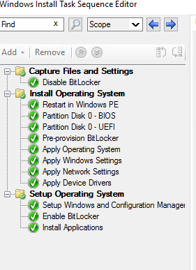

# Install And Setup
At least an E3 License is needed for a MECM license 19/07/22

Best idea to have 2 extra 500gb drives and put them in parody as it makes it faster and redundant as this is your main config unlike how ive done it or if its virtualized put it onto redundant storage

Best to have the C:\ more than 50GB 



Create the following drives

# User Group Based Collection


```sql
select SMS_R_USER.ResourceID,SMS_R_USER.ResourceType,SMS_R_USER.Name,SMS_R_USER.UniqueUserName,SMS_R_USER.WindowsNTDomain 
from SMS_R_User 
where SMS_R_User.SecurityGroupName = "BG\\Domain Admins"
```
```
BG\\Domain Admins 
This is the group you want to target 
"BG" is the NETBIOS name
"Domain Admins" is the Group name
```
Its best to include an EXCLUDE from domain admins as you might have Domain Admins with that role
```sql
select SMS_R_USER.ResourceID,SMS_R_USER.ResourceType,SMS_R_USER.Name,SMS_R_USER.UniqueUserName,SMS_R_USER.WindowsNTDomain from SMS_R_User 
where SMS_R_User.SecurityGroupName = "BG\\Domain Users"
```
# Loading an .EXE to software centre

1. Manually specify the application info
2. Fill out name, rest is optional
3. Software Centre Info also optional
4. Click Add on Deployment Types
    - type is Script installer
    - Name (REQURED)
    - Fill out content location and all relitive info where it is
        - for installing **follow**

            “CitrixWorkspaceApp1911.exe” /Silent /NoReboot /ForceInstall /AutoUpdateCheck=Disabled
            - USE "yourapp.exe"
            find the silent install on https://silentinstallhq.com/
            
                To find where the install location check what path the uninstall location is and has a general hint where the file is downloaded

    - Detection rule would be to follow where it installs (you can find this where unistall location is)
    - the best method of user experience is, Install for system
    - the rest just spam next till the close button pops up
5.  Your done!


# OS deployment
Need an Windows X ISO with a .wim install file,
Make sure the MECM host has PXE boot off until all settings are finalised


# Troubleshooting stick Dirstrobution



# Azure Endpoint Manager
Azure Endpoint manager is easy for mobile devices and lots of them as they are not always on preemies

# Task Sequence


Enabling bit locker is good practice but older devices may not support

Make Sure to boot into UEFI when using bitlocker


