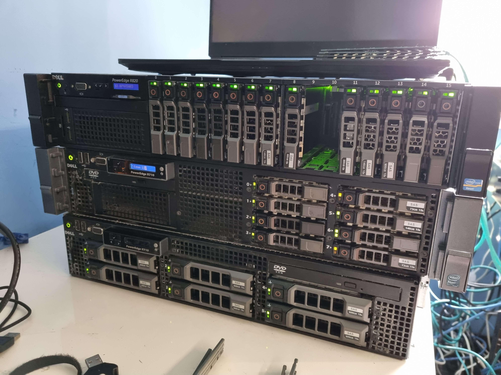

# Harrison Bostock

What i specialize in

- Networking, Ubiquiti, HPE, cisco
- Windows AD
- Microsoft Azure, MECM

To show how ive done most of my journey through my learning space

Check the folders in this repository, its got my understanding of basic topics of the names of the files

## My IT journey

pic of my *rack* aka a desk

My IT journey started back when i was around 8-9ish when i got given an old Windows XP pc from my Mum and dad, and from there it started, from there i got handed randome laptops from my parents friends and i used to do a bunch, used to make game servers for my buddies, ways to get around the school internet.

My now understanding is much much greater now, the basic principals i used to know i have greatly expanded into now, ive now got such a massive Home lab with over powered servers for what i do, But i appreciate everything i own and how. Ive come a long way from where i started out, just running vms on my main desktop and evaluating them there, but i loved the aspect of running a proper production environment that i could test and delpoy products i had used on my time at QML on work experience.

At QML i was using AD and SCCM (MECM) (for my first time in the wild), my first time there inspired me so much to start learning the basic principals i needed In the Sytems admin / Network Admin space. From there i learned Windows Server Management, I learned how to use SCCM to image devices, Learnt a little about the basic troubleshooting of citrix appservers.