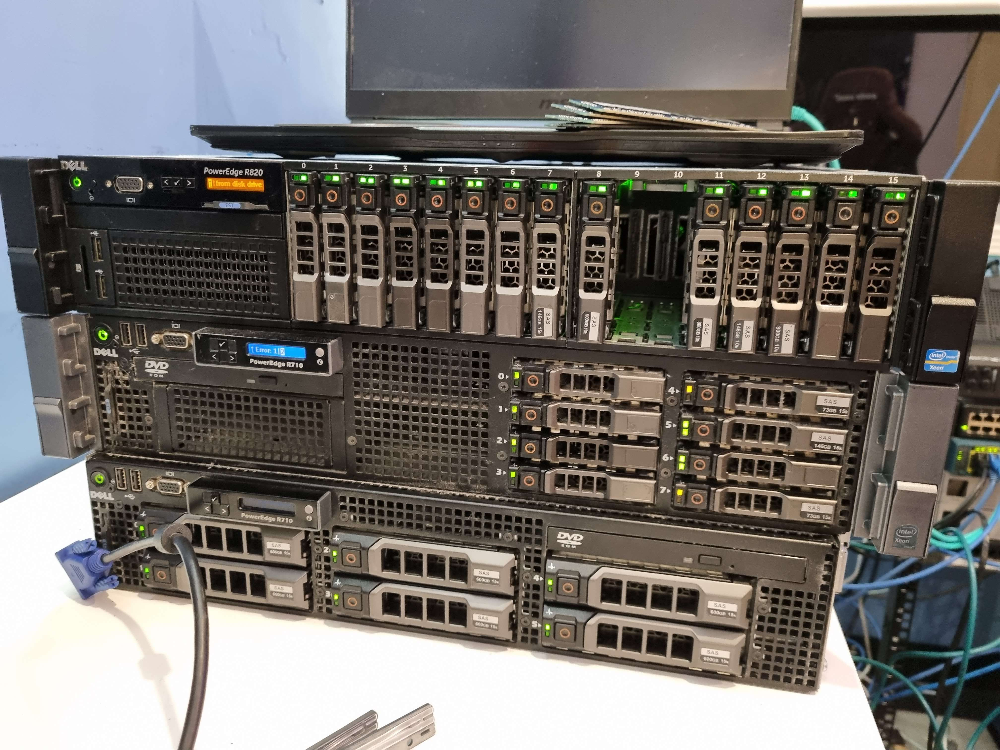

# Harrison Bostock

What i specialize in

- Networking
- Windows AD
- Microsoft Azure, MECM

To show how ive done most of my journey through my learning space

Check the folders in this repository, its got my understanding of basic topics of the names of the files

## My IT journey

pic of my *rack* aka a desk

My IT journey started back when i was around 8-9ish when i got given an old Windows XP pc from my Mum and dad, and from there it started, from there i got handed randome laptops from my parents friends and i used to do a bunch, used to make game servers for my buddies, ways to get around the school internet.

My now understanding is much much greater now, the basic principals i used to know i have greatly expanded into now, ive now got such a massive Home lab with over powered servers for what i do, But i appreciate everything i own and how. Ive come a long way from where i started out, just running vms on my main desktop and evaluating them there, but i loved the aspect of running a proper production environment that i could test and delpoy products i had used on my time at QML on work experience.

At QML i was using AD and SCCM (MECM) (for my first time in the wild), my first time there inspired me so much to start learning the basic principals i needed In the Sytems admin / Network Admin space. From there i learned Windows Server Management, I learned how to use SCCM to image devices, Learnt a little about the basic troubleshooting of citrix appliances.

What ive Currently got done, im finishing year 11, Ive completed a Cert III at Tafe On ICT General Foundations, the course was outlining all the Documentation on how you would go about in IT, covering the basic laws of privacy, How to Make a basic HTML Website, Coding a terminal application in C#, Making a simple Active Directory Setup

# What do i have a basic understanding of

#### What i have a really good understanding of

- Microsoft Active Directory
    - Ive setup 4 AD controllers Replicating
    - Setup proper DNS delegation
    - Setup DFS and had them replicate to a remote site
- Microsoft Configuration Endpoint Manager
    - Setup 2 SCCM Distrubution points, 2 Different AD sites
    - Made Sure Replication of Both Sites was working
- Basic Docker Compose Configuration
- High Level networking, 
    - Setup S2S Networking VPN
    - Setup Mutiple SOHO networks, Small Businesses
    - VSAN, Sans
    - Complicated DHCP subnets
- VDI, Kasm workspaces, Citrix VDI, MS vdi
    - ive used and deployed MS vdi Multiple Times in a lab environment and used in the real world environment
- General understanding on Linux, Bash terminal
    - I have used Ubuntu server as my main environment i have learnt on, installing Kubenates (k3s) and deploying a webserver with a proper load balancer (https://tafe.bostockgroup.com) and also deployed multiple web applications with JS baked in, sadly at the time i was doing all this i needed to redo my whole way i clustered them so i lost that data
    - My Other basic understanding of Linux Bash is bash scripting, Such as a simple Bash Script to provision a server for use.

#### What i could gain a better knowledge on And will

- Powershell Scripting
    - I have used powershell before and the scripting aspects of it make it a really powerful tool, Especially for those who are willing to learn, Willing to make their production environment more efficient. ive made multiple little powershell scripts to make my life easier, such as one to sync and setup the time settings on a Domain Controller
    - I want to learn more aspects of powershell scripting as to make my life easier say setting up a windows server, Provisioning clients, and overall performing mundane tasks

# Strengths And weaknesses

## Strengths

- Im willing to learn, study
- Im willing to spend extra time on a project
- I have dedication to something i start i have to finish it
- I can volunteer some of my time, to help
- i don't mind staying back 

## Weaknesses

- If i dont like something, i wont hold back and Tell you (sometimes with no filter).
- I make sure the job is perfect if i think it should be, spending too much time on something.
- i like to be left alone at times to do my own work.
